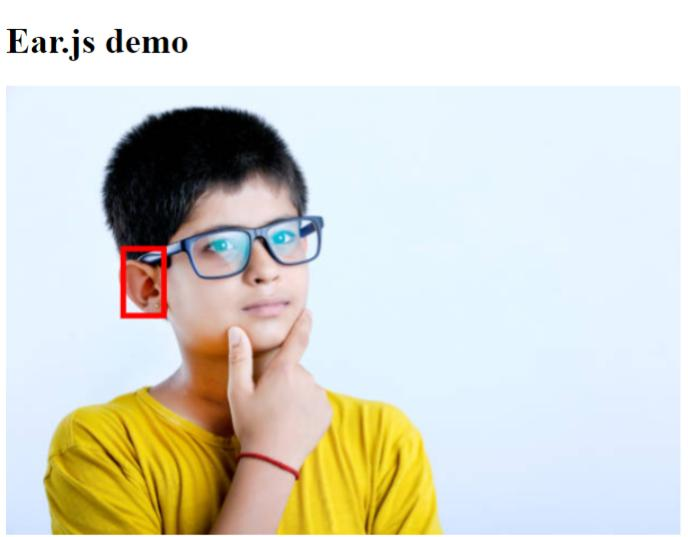

# ear.js

  
*An example inference*

This project was started by dewball345

Object detection libraries are everywhere, and you can find python, web, and other implementations of them. But I have yet to find a comprehensive object detection for ear detection, let alone one that is real-time and in the web. So I created ear.js, a javascript library for real-time ear object detection. 

## Features
1. Ear.js is easy to implement in your code, with prebuilt classes for preprocessing, postprocessing, and drawing results to canvas.
3. Ear.js is very flexible; it only gives you what you need to have(the final inference data), and from that you can use it in many ways

## Realtime?
* On a relatively high end PC performance was about 15 fps. 
* On a mid-tier mobile the model took a long time to load and inference speed was only 3 fps
* On a low-tier mobile i couldn't even load the model(had to use no-throttling to load the model) and the inference speed was 2 fps

Please test your fps on your device using the web demo. 
## Demo
* Demo with code on [Glitch](https://glitch.com/edit/#!/field-inexpensive-fright)
* Web demo found [here](https://dewball345.github.io/ear.js/)

## Installation

### Clone this repo

Type `git clone https://github.com/dewball345/ear.js.git`. You will see an index.html and index.js file with sample code. Keep the import statements in the html and javascript files.

### Use CDN

If you want to use the project externally, you can use CDN. In your javascript file type:

`import {EarModel, GeneralUtils} from https://cdn.jsdelivr.net/gh/dewball345/ear.js/ear.js`

to use the Ear model and have access to some other utilities that may be useful(like drawing to a canvas)

## Tutorial

A tutorial is currently being developed. You can view the tutorial [HERE](TUTORIAL.md)

## Disclaimers!

This project is still under development, so you can expect things to change. In addition, the model, which can be found [HERE](https://github.com/dewball345/ear.js-model) is not ready for use in production. I have yet to train it with other data besides me.

### FULL NOTICE:

> This model is based on the yolo-v5s architecture and retrained to detect ears.  
> However, this model is far from done; it was only trained on pictures of me(with the intent of using a dataset like celeb-faces or something later), so the model will not work on everyone.   
> Don't expect optimal performance right now, especially if you look different than I do. I will update these files once I retrained my model on a more diverse set of faces.   
> And after I update my files, I may decide to add metrics like MAP. Right now, assume that it's performance is similar to yolov5 in [ultralytics' repository](https://www.github.com/ultralytics/yolov5)  

## Issues and PRs

Please write your issue in the issue tracker

## Licence

dewball345/ear.js is licensed under the BSD 3-Clause "New" or "Revised" License

